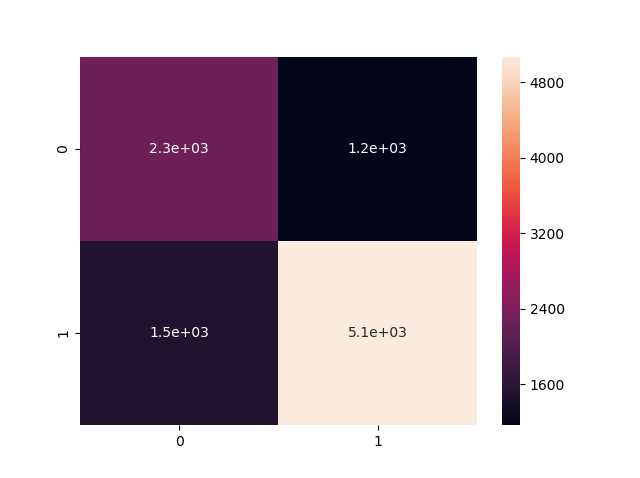
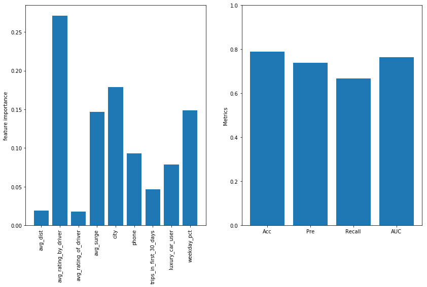
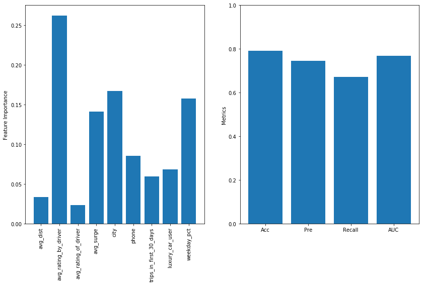
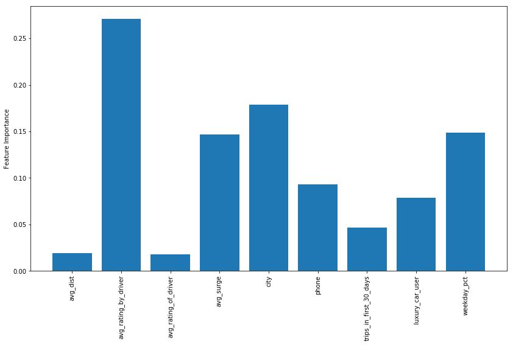
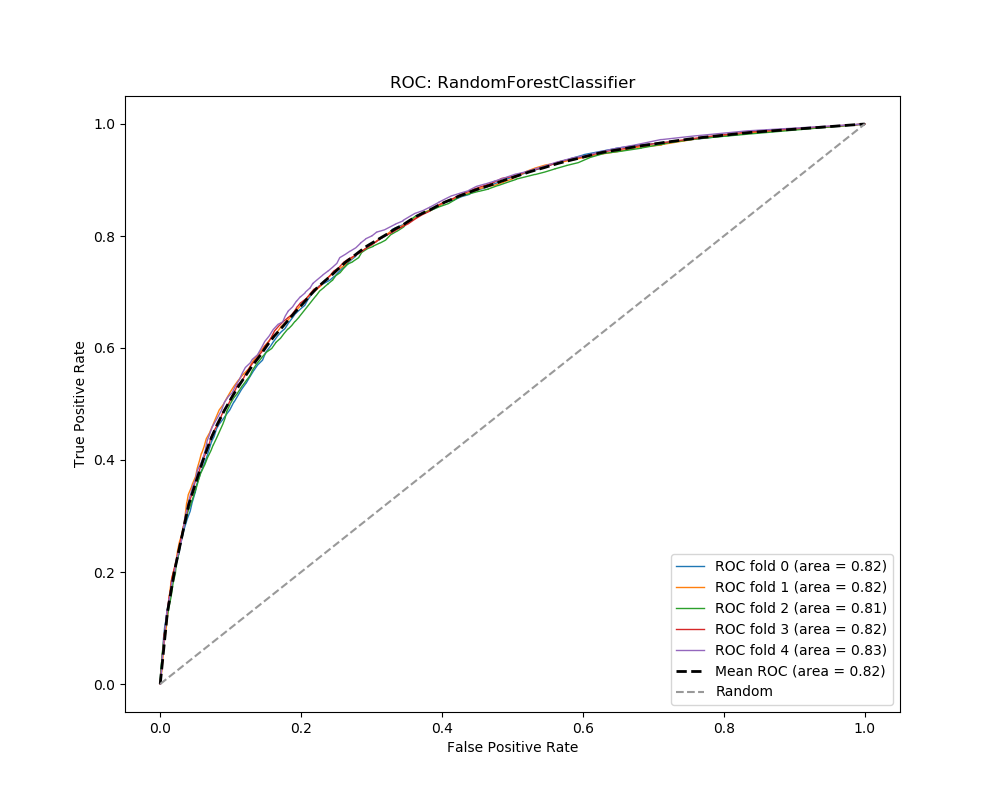
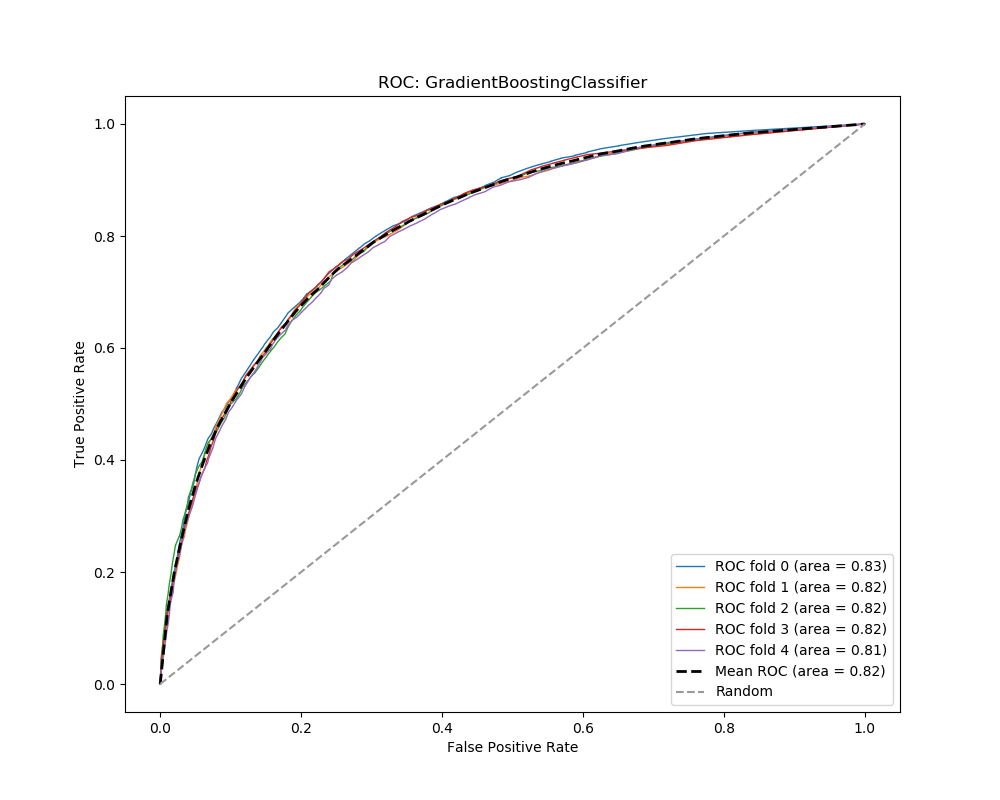

# Rideshare Churn
### Aidan Jared, Derek Lorenzen, Nathan James

## EDA
As any good data scientist we first did some EDA to understand the data structure and what the featers are. Thankfully the [included markdown](group.md) explained the data which speed up the EDA. The data set was made up of 11 features and the point at which and individual churned was if they had not used the rideshare for more than 30 days. We found that there was about 33% `active` users and 66% `not active` With this information we moved onto the data cleaning.

## Cleaning
For the cleaning our first dessision was to remove the surge_pct feature because there was also a surge_avg column and we felt that including both features would have produced multicolinarity in the model which is never desired. After this dessision we developed a cleaning function in order to clean both the training and testing data the same way.
```python
drop = ['surge_pct']

def clean(df, drop_list):
    df_ = df.drop(drop_list, axis=1)
    cities = list(df_['city'].unique())
    for index, i in enumerate(cities):
        df_['city'].where(df_['city'] != i, index + 1, inplace=True)
    phones = df_['phone'].unique()
    for index, i in enumerate(phones):
        df_['phone'].where(df_['phone'] != i, index + 1, inplace=True)
    df_['signup_date'] = pd.to_datetime(df_['signup_date'], infer_datetime_format=True)
    df_['last_trip_date'] = pd.to_datetime(df_['last_trip_date'], infer_datetime_format=True)
    date = pd.to_datetime('20140601', infer_datetime_format=True)
    df_['churn'] = df_['last_trip_date'] >= date
    df_ = df_.drop(['signup_date','last_trip_date'], axis=1)
    df_ = df_.fillna(0)
    return df_
```

The thing the cleaning function did is that it when through the two catigorical features, city and phone, and then changed the values into intigers so that sklearn could take them as inputs and produce a model. After this we changed to last_trip_date column to a date time object so we could start the creation of our y column. Then we took the cutoff date and made the y by figuring out which individuals haven't used rideshare for more than 30 days. With this done it was time to move onto random forest.

## Random Forest

As a group we decided that random forest would be a good model to work with first because it is easy to set up and produce a good random forest in the time that we had.

```python
rf = RandomForestClassifier(n_estimators=100, random_state=1, oob_score=True, bootstrap=True)
rf.fit(X_train_s, y_train_s)
y_pred = rf.predict(X_test_s)

```
We set the number of estimators to be 100 and left the max number of features to be the default. The following is a plot of the feature importance that the model produced


on top of this we found the following performance metrix that we started using to tune our model

|Metrics|
|:-----:|
|acc:  0.755|
|pres:  0.674|
|recall:  0.659|
|oob:  0.751|
and the confusion matrix:


What these values show is that our first model predicts better than random guessing but still produces a lot of false negatives and nees more fine tuning to produce a better model.

Our last step in random forest was to fine tune our model to see if we could produce better results. As such we ran a for loop iterating through multiple max features to find what we should set this to be in our final model. After our test of this we found that only using one feature produced the hightest acuracy which couldn't be right. After talking it over and getting some help we tested the same code with multiple random states to see how noise effects the acuracy.

as you can see there flutuations depending on the random state that is used but, it seems to be that using 8 features tends to produce the highest acuracy even though there is very little difference between the models.

after running this model on the test data we got the following results

|Metrics|
|:-----:|
|acc:  0.733|
|pres:  0.661|
|recall:  0.602|
|oob:  0.751|
and the confusion matrix


these values show that our model does perform sligtly worse on the test data as expected but it does perform very well for the amount of data we have.

## Gradient Boosting

The Gradient Boosting Algorithm Performed slightly better than our Random Forest.

The default valued version resulted in:

### Confusion Matrix:   

| |Positive_a | Negative_a
| ---:|---|:---
|True_p | 1987 |  705  
|False_p | 985 | 4323  

> Accuracy:  0.789  
> Precision:  0.738  
> Recall:  0.669  
> AUC:  0.764  
> Test AUC: 0.734

Notable default values:
* N_Estimators = 100
* Learning Rate = 0.1



To optimize, we iterated through various collections of:
* N_Estimators, Ideal = 220
* Learning Rate, Ideal = 0.2

#### Confusion Matrix:    

| |Positive_a | Negative_a
|---|---|---
|True_p | 1995 |  684  
|False_p | 977 | 4344

> Accuracy:  0.792  
Precision:  0.745  
Recall:  0.671  
AUC:  0.768
Test AUC: 0.738



### Changes between models:

> Accuracy Delta:  0.00362  
Precision Delta:  0.00656  
Recall Delta:  0.00269  
AUC Delta:  0.00343  
Test AUC Delta: 0.004

### Feature Importances   

#### Gradient Boosting

#### Random Forest


Notes:

From this, we infer that the driver rating of the passenger was a highly important feature to include.
Further, city (categorical) and phone OS (categorical) were also important but we cannot act on magnitude or direction like with a coefficient.

Within SKLearn:
* To determine quality of split, friedman_mse is utilized as the default metric.
* Fit on negative gradient of previous split, minimizing deviance


## Roc Curve
The receiver operating characteristic is similar between cross-validation folds and between models. The dataset is relatively large so the small variance between the tests makes sense as the models have plenty of data to train on.






## Conclusion
The Random Forest and Gradient Boosting models performed similarly. The models perform better than random guessing and do a decent job of predicting churn. We wanting to do some more tuning with gradient boosting to see if the model could be improved. The next step would be doing a grid search to find the best hyperparameters for the model. It is interesting that the gradient boosting model did slightly better without much tuning.

The feature importances were different between the models. Further analysis using partial dependence plots to identify the effect each feature had would be another further step to investigate.


## Case Study

Today we are going to use all the skills we have learned to tackle a real
problem in industry. The problem is churn prediction with a ride-sharing
company in San Francisco.  Since the data is sourced from a real company, we
ask you not to share the dataset. See more about the problem in
[group.md](group.md).
